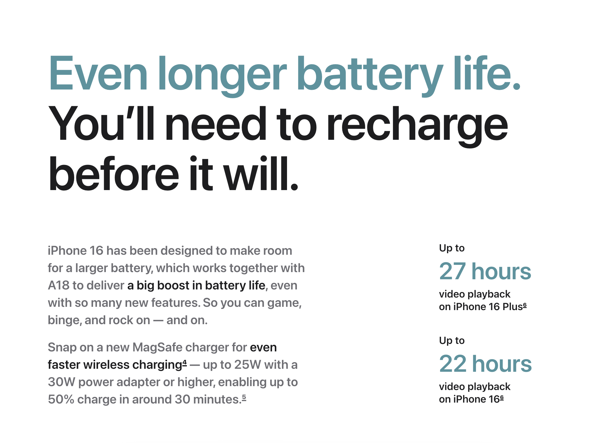

# HW-HC-005




### 文字

```
Even longer battery life.
You’ll need to recharge
before it will.

iPhone 16 has been designed to make room for a larger battery, which works together with A18 to deliver a big boost in battery life, even with so many new features. So you can game, binge, and rock on — and on.

Snap on a new MagSafe charger for even faster wireless charging — up to 25W with a 30W power adapter or higher, enabling up to 50% charge in around 30 minutes.

Up to
27 hours
video playback
on iPhone 16 Plus

Up to
22 hours
video playback
on iPhone 16
```

<!-- [來源網站](https://www.apple.com/iphone-16/) -->