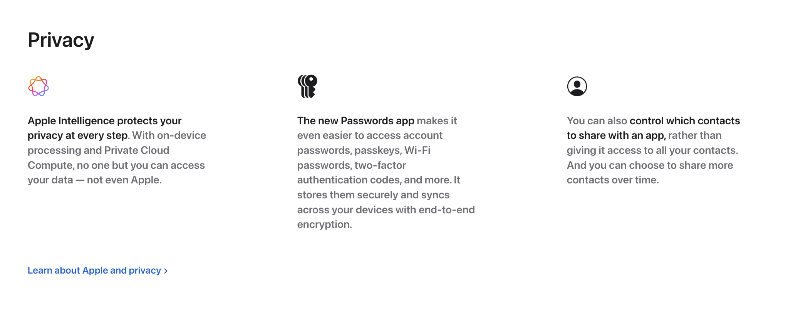

# HW-HC-006




### 文字

```
Privacy

Apple Intelligence protects your privacy at every step. With on-device processing and Private Cloud Compute, no one but you can access your data — not even Apple.

The new Passwords app makes it even easier to access account passwords, passkeys, Wi-Fi passwords, two-factor authentication codes, and more. It stores them securely and syncs across your devices with end-to-end encryption.

You can also control which contacts to share with an app, rather than giving it access to all your contacts. And you can choose to share more contacts over time.

Learn about Apple and privacy
```

### 圖片


<!-- [來源網站](https://www.apple.com/iphone-16/) -->